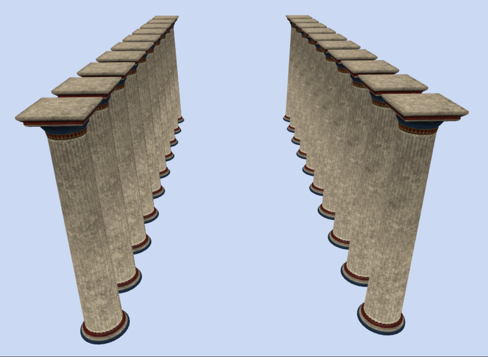
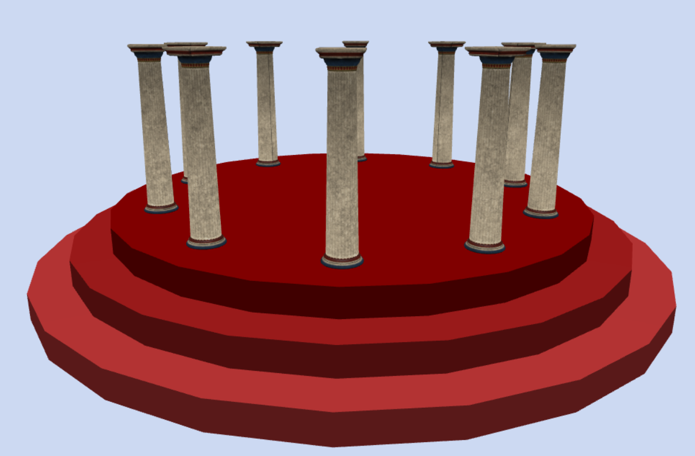

# ArraysAndLoops
Part 3.3

# Часть 1
## Создайте две параллельные колоннады (коридор из колонн), по 10 колонн с каждой стороны.

Итог выполнения задания:

# Часть 2
## Дополнительно (по желанию): используя цикл for, создайте круг из колонн, которые стоят на фундаменте, состоящим из нескольких круглых ступенек.

Итог выполнения задания:
